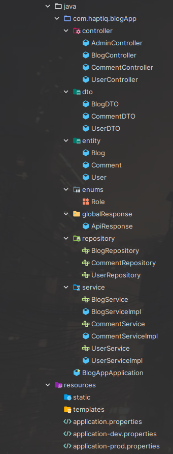
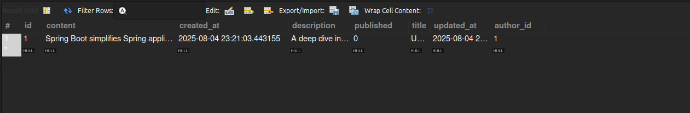
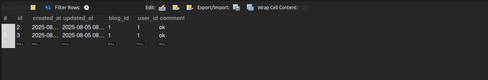
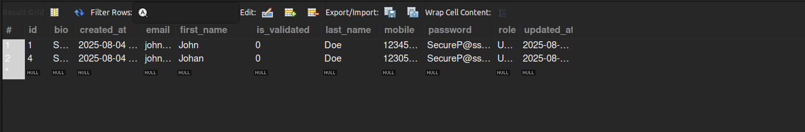

# 📝 BlogApp - RESTful Blogging Platform

A robust RESTful web service built using Spring Boot to support user registration, blog creation, and blog interaction through comments. This modular, maintainable project returns clean JSON responses, implements pagination, and follows best practices in layered architecture.

---

## 📌 Features

- ✅ Register users with profile information
- ✅ Write, edit, delete, and fetch blog posts
- ✅ Add and manage comments on blog posts
- ✅ Pagination and filtering by author/user
- ✅ Layered architecture: Controller → Service → Repository
- ✅ Global API response format using `ApiResponse`
- ✅ Clean HTTP status codes and error handling

---

## 📂 Project Structure




---

## 🌐 API Endpoints

### 👤 User Endpoints (`/user`)

| Method | Endpoint          | Description                     |
|--------|-------------------|---------------------------------|
| POST   | `/register`       | Register a new user             |
| GET    | `/byId`           | Get user by ID (`userId`)       |
| GET    | `/byName`         | Get user by email/username      |

---

### 📝 Blog Endpoints (`/blog`)

| Method | Endpoint          | Description                               |
|--------|-------------------|-------------------------------------------|
| POST   | `/add`            | Create a new blog                         |
| PUT    | `/update`         | Update existing blog (by `id`)            |
| DELETE | `/delete`         | Delete blog (by `blogID`)                 |
| GET    | `/byID`           | Get a blog by its ID                      |
| GET    | `/all`            | Get all blogs with pagination             |
| GET    | `/byAuthor`       | Get blogs by author ID with pagination    |

**📌 Query Params for pagination:**

---

### 💬 Comment Endpoints (`/comment`)

| Method | Endpoint          | Description                                    |
|--------|-------------------|------------------------------------------------|
| POST   | `/add`            | Add a comment (requires `userID`, `comment`, `blogId`) |
| DELETE | `/delete`         | Delete a comment by `commentID`               |
| GET    | `/byBlog`         | Get all comments by blog ID (paginated)       |
| GET    | `/byUser`         | Get all comments by user ID (paginated)       |

---

## 🔧 Technologies Used

- **Java 17+**
- **Spring Boot 3.x**
- **Spring Web, Spring Data JPA**
- **MySQL** (via `application-*.properties`)
- **DTO pattern** for cleaner API models
- **RESTful JSON responses** using `ResponseEntity`
- **Lombok**
- **Maven**

---

## ⚙️ Configuration & Profiles

The project supports multiple environments using Spring Profiles:

```properties
spring.profiles.active=dev
spring.profiles.active=prod
for diff profiles respectively

# Clone the project
git clone https://github.com/your-username/blogApp.git
cd blogApp

# Build and run
mvn clean install
mvn spring-boot:run
```

---
## 🗄️ Database View








### 📦 Sample Response: Get All Blogs (`/blog/all`) with pagination

```json
{
  "Content: ": [
    {
      "id": 1,
      "title": "Understanding Spring Boot in advanced",
      "description": "A deep dive into Spring Boot features and setup.",
      "content": "Spring Boot simplifies Spring application development by providing production-ready defaults...",
      "comments": [
        {
          "id": 2,
          "comment": "ok",
          "createdAt": "2025-08-05T08:09:54.685507",
          "updatedAt": "2025-08-05T08:09:54.685528"
        },
        {
          "id": 3,
          "comment": "ok",
          "createdAt": "2025-08-05T08:09:56.653005",
          "updatedAt": "2025-08-05T08:09:56.653027"
        }
      ],
      "published": false,
      "createdAt": "2025-08-04T23:21:03.443155",
      "updatedAt": "2025-08-04T23:24:04.760269"
    }
  ],
  "Total elements: ": 1,
  "hasNext: ": false
}

